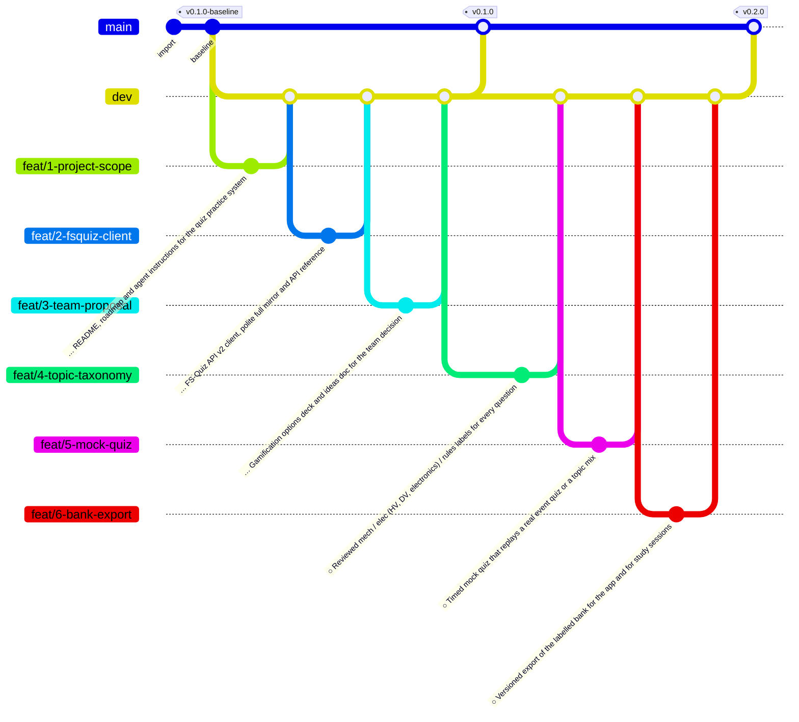

<!--
  Auto-generated from .github/roadmap.yaml by
  .github/scripts/render_roadmap.py. Do not edit this file directly —
  changes will be overwritten on the next run of the `Render ROADMAP`
  workflow. Edit the YAML or close / reopen a tracking issue instead.
-->

# IFS-Tests roadmap

Plan for the team's Formula Student quiz practice system. Each phase
is a cluster of feat branches cut from `dev`; a milestone tag on `main`
closes the phase once every branch in it has merged. Branch status
badges (✅ / 🔄 / 🔜 / ⏸) are derived from each branch's tracking issue
state in GitHub Issues.

Phases 1 and 2 are the groundwork: understand the FS-Quiz data, mirror
it, sort it into mechanical and electrical topics, and make it
practicable. Phases 3 and 4 (web app, daily question, leaderboard,
Notion tracking) are **deferred until the team decides the format**;
the options are laid out in `docs/proposals/`.

## Phase summary

| Phase | Title | Branches | Milestone tag |
|:---:|---|---|---|
| 1 | Foundations | 🔄 active `feat/1-project-scope` · 🔄 active `feat/2-fsquiz-client` · 🔄 active `feat/3-team-proposal` | `v0.1.0` |
| 2 | Question bank & practice Offline, no accounts: usable by anyone with the repo | 🔜 planned `feat/4-topic-taxonomy` · 🔜 planned `feat/5-mock-quiz` · 🔜 planned `feat/6-bank-export` | `v0.2.0` |
| 3 | Team platform _(deferred)_ Pending team decision: format, hosting, sign-in (see docs/proposals) | ⏸ deferred `feat/7-web-app` · ⏸ deferred `feat/8-uni-sign-in` · ⏸ deferred `feat/9-daily-question` · ⏸ deferred `feat/10-leaderboard` | `v0.3.0` |
| 4 | Tracking & quiz day _(deferred)_ Pending team decision: what we track and where | ⏸ deferred `feat/11-notion-sync` · ⏸ deferred `feat/12-quiz-day-drill` | `v0.4.0` |

## Branch diagram

---

## How this file is maintained

- **Source of truth**: [`.github/roadmap.yaml`](.github/roadmap.yaml)
- **Renderer**: [`.github/scripts/render_roadmap.py`](.github/scripts/render_roadmap.py)
- **Workflow**: [`.github/workflows/roadmap.yml`](.github/workflows/roadmap.yml)

The workflow runs on every push to `dev`. If any branch status changed
(a tracking issue was closed, the YAML was edited, a new branch was
added) it regenerates this file and auto-commits with the message
`chore: regenerate ROADMAP.md [skip ci]`.
