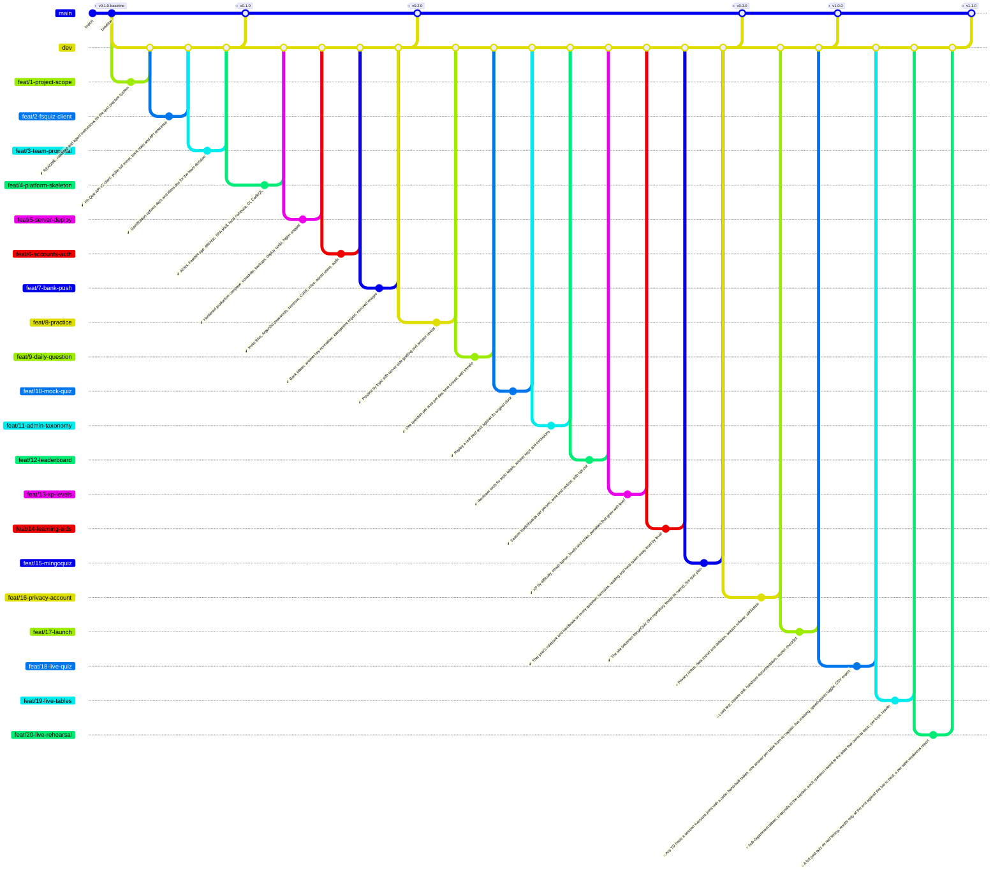

<!--
  Auto-generated from .github/roadmap.yaml by
  .github/scripts/render_roadmap.py. Do not edit this file directly —
  changes will be overwritten on the next run of the `Render ROADMAP`
  workflow. Edit the YAML or close / reopen a tracking issue instead.
-->

# IFS-Tests roadmap

Plan for the team's Formula Student quiz training platform. Each phase
is a cluster of feat branches cut from `dev`; a milestone tag on `main`
closes the phase once every branch in it has merged. Branch status
badges (✅ / 🔄 / 🔜 / ⏸) are derived from each branch's tracking issue
state in GitHub Issues.

Phase 1 is the groundwork (FS-Quiz mirror, proposal). Phases 2–4 build
the web app on the team's own server: invite + password accounts,
practice, mock quizzes, a daily question and a leaderboard. The design
is in `docs/architecture.md` and `docs/adr/`. Phase 5 collects ideas for
after launch.

## Phase summary

| Phase | Title | Branches | Milestone tag |
|:---:|---|---|---|
| 1 | Foundations | ✅ done `feat/1-project-scope` · ✅ done `feat/2-fsquiz-client` · ✅ done `feat/3-team-proposal` | `v0.1.0` |
| 2 | Platform foundation Staging live on the team server, accounts and the question bank in place | ✅ done `feat/4-platform-skeleton` · ✅ done `feat/5-server-deploy` · ✅ done `feat/6-accounts-auth` · ✅ done `feat/7-bank-push` | `v0.2.0` |
| 3 | Training MVP One branch per way of answering questions, then the tools around them | ✅ done `feat/8-practice` · ✅ done `feat/9-daily-question` · ✅ done `feat/10-mock-quiz` · ✅ done `feat/11-admin-taxonomy` · ✅ done `feat/12-leaderboard` · ✅ done `feat/13-xp-levels` · ✅ done `feat/14-learning-aids` · ✅ done `feat/15-mingoquiz` | `v0.3.0` |
| 4 | Launch | 🔜 planned `feat/16-privacy-account` · 🔜 planned `feat/17-launch` | `v1.0.0` |
| 5 | Team play Live quiz sessions for team meetings and vertical training (ADR 0005) | 🔜 planned `feat/18-live-quiz` · 🔜 planned `feat/19-live-tables` · 🔜 planned `feat/20-live-rehearsal` | `v1.1.0` |
| 6 | After launch _(deferred)_ Ideas to prioritise with the team once the MVP is in use | ⏸ deferred `feat/21-admin-totp` · ⏸ deferred `feat/22-notion-sync` · ⏸ deferred `feat/23-solution-bounty` · ⏸ deferred `feat/24-team-questions` · ⏸ deferred `feat/25-rule-page-links` | `v1.2.0` |

## Branch diagram

---

## How this file is maintained

- **Source of truth**: [`.github/roadmap.yaml`](.github/roadmap.yaml)
- **Renderer**: [`.github/scripts/render_roadmap.py`](.github/scripts/render_roadmap.py)
- **Workflow**: [`.github/workflows/roadmap.yml`](.github/workflows/roadmap.yml)

The workflow runs on every push to `dev`. If any branch status changed
(a tracking issue was closed, the YAML was edited, a new branch was
added) it regenerates this file and auto-commits with the message
`chore: regenerate ROADMAP.md [skip ci]`.
