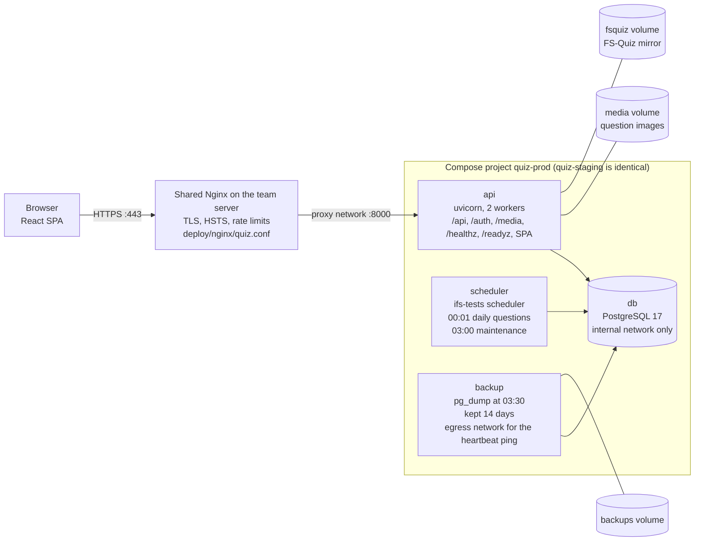
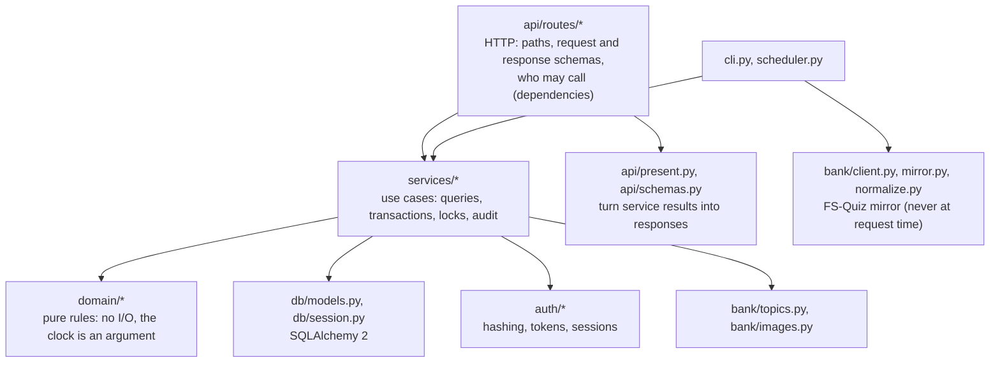
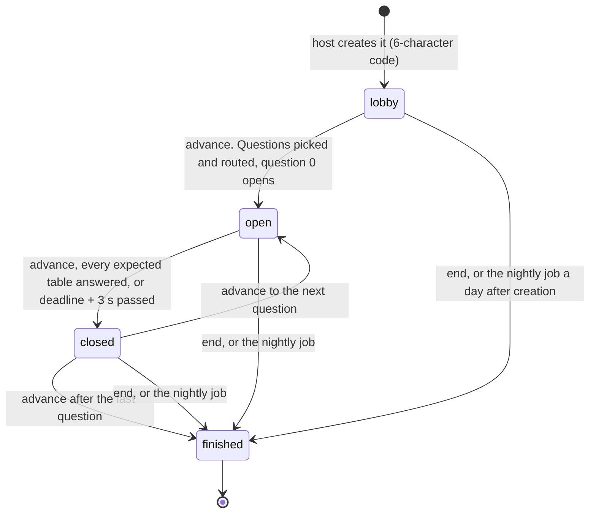
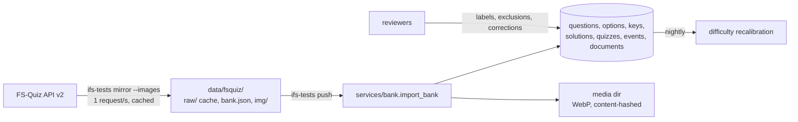

# Architecture

How MingoQuiz is built, for someone about to change it. Decisions and their reasons are in [`adr/`](adr/); the rules of the game (rank, LP, XP, streaks, leaderboards) are in [game-rules.md](game-rules.md); tables and migrations in [data-model.md](data-model.md); the HTTP API in [api.md](api.md); operating the server in the [runbook](runbook.md).

## Overview

One Python service (FastAPI) serves both the JSON API and the React single-page app from the same origin, backed by one PostgreSQL database. A second container runs the same image as a scheduler for the nightly jobs. Everything runs with Docker Compose on the team's Hetzner server, behind the server's shared Nginx ([ADR 0001](adr/0001-fastapi-modular-monolith.md), [ADR 0003](adr/0003-self-hosted-on-team-server.md)).

- **One origin.** FastAPI serves `/api/*` (JSON), `/auth/*` (sign-in, registration, resets), `/media/*` (question images), `/assets/*` (the built SPA's hashed files), `/healthz` and `/readyz`, and `index.html` for every other GET so the SPA's client-side routes work. No CORS, simple cookies. See `create_app` in `src/ifs_tests/api/app.py`.
- **The database is never exposed.** `db` and `scheduler` sit only on an internal Docker network with no route out; `api` also joins the `proxy` network that Nginx uses, and `backup` an `egress` network used only for its heartbeat ping. Hardening of the containers is in [security.md](security.md).
- **Backups:** the `backup` container dumps the database nightly and before every deploy (`deploy/db/backup.sh`); Hetzner also snapshots the whole server. Restores are in the [runbook](runbook.md).
- **Local development** runs only `db` and `api` (`compose.yaml` at the repository root); there is no scheduler locally, so run `docker compose exec api ifs-tests maintenance` when you need the nightly job.

## Code layers

Rules that keep it maintainable:

- **Domain code has no I/O.** Functions in `domain/` receive data and the current time as arguments, so they are unit-tested with tables of cases and no database.
- **Services own transactions.** A service function receives the SQLAlchemy session, the acting `User` and `now`, commits what it changes, and raises `UserError` (`services/errors.py`) for anything the user should read. There is no separate repository layer (ADR 0001 mentions one; the code queries SQLAlchemy directly in services).
- **Authorization happens in FastAPI dependencies** (`api/deps.py`), plus a few checks that need data (a live quiz's host, a table's captain) in the service. The user ID always comes from the session cookie, never from the request.
- **Responses are explicit Pydantic schemas** (`api/schemas.py`, classes deriving from `Out`), never ORM objects, so nothing leaks by accident. Request bodies derive from `In`, which forbids unknown fields and NUL characters.

## Module map

Everything under `src/ifs_tests/` (empty `__init__.py` files left out).

| Module | Owns |
|---|---|
| `__init__.py` | The package version (from the installed package metadata), shown by `/healthz` and the OpenAPI document |
| `settings.py` | Configuration from `IFS_*` environment variables or `.env`: environment, database URL, public origin, paths, database pool size; cookie name and CSRF origins derived from them; refuses to start staging or prod without `https://` |
| `cli.py` | The `ifs-tests` command: `mirror`, `stats`, `show`, `topics`, `push`, `openapi`, `create-admin`, `invite`, `reset-link`, `maintenance`, `scheduler` |
| `scheduler.py` | A minimal daily job runner for the `scheduler` container (Madrid times, a heartbeat file for the health check, touched only while the database answers) |
| **api/** | |
| `api/app.py` | Builds the FastAPI app: middleware, exception handlers, routers, `/healthz` (liveness) and `/readyz` (a database query), 404 for unknown `/api` and `/auth` paths, `/media` and SPA static files |
| `api/security.py` | `SecurityHeaders` (CSP and other headers on every response) and `CSRFGuard` middleware |
| `api/deps.py` | Request dependencies: database session `Db`, clock `Now`, `AppSettings`, and the role guards `Member`, `Reviewer`, `Admin`; `background_db` for work after the response |
| `api/schemas.py` | Every request and response body; field descriptions end up in the OpenAPI document |
| `api/present.py` | Turns service results (`Shown`, `Checked`) into `PlayQuestion` and `Feedback` bodies, shared by practice, daily, mock and live |
| `api/routes/auth.py` | `/auth`: sign in and out, invite and reset lookups, registration, password reset; sets the session cookie |
| `api/routes/me.py` | `/api/me`: own profile and progress, profile changes, password change, data export, account deletion |
| `api/routes/admin.py` | `/api/admin`: users, invites, reset links, sessions, alumni, exports and deletion on someone's behalf, audit log, bank summary |
| `api/routes/practice.py` | `/api/practice`: areas, next question, answer, hint |
| `api/routes/daily.py` | `/api/daily`: today's status, start, answer, review, hint |
| `api/routes/mock.py` | `/api/mock`: quiz list, start a run, run state, answer, hint |
| `api/routes/review.py` | `/api/review` (reviewer queues, question edits, answer corrections, reports) and `/api/questions/{id}/report` (any member) |
| `api/routes/leaderboard.py` | `/api/leaderboard`: boards by area and period, vertical board |
| `api/routes/learning.py` | `/api/learning/{topic}`: formulas and reading for a topic |
| `api/routes/live.py` | `/api/live`: live quiz sessions, hosting, seating, answering, results CSV, the Server-Sent Events stream |
| **auth/** | |
| `auth/passwords.py` | Argon2id hashing on a two-thread pool, the password policy, the common-password list (`common_passwords.txt`) |
| `auth/tokens.py` | 256-bit random tokens and their SHA-256 hashes (sessions, invites, resets) |
| `auth/sessions.py` | Server-side sessions: create, resolve a cookie to a user (with idle and absolute expiry), end, purge |
| **bank/** | |
| `bank/client.py` | Thin, polite FS-Quiz API v2 client (delay between requests, retries, user agent); base URLs for images and documents |
| `bank/mirror.py` | Mirrors the whole bank to `data/fsquiz/` with a raw-response cache, optionally with images |
| `bank/normalize.py` | Turns raw FS-Quiz responses into one consistent `bank.json` (see [fsquiz-api.md](fsquiz-api.md) for the quirks) |
| `bank/topics.py` | First-pass keyword tagging of area and topic; the list of topics per area |
| `bank/images.py` | Converts images to WebP under 150 KB, named by content hash |
| `bank/stats.py` | `ifs-tests stats` and `show` reports on the local mirror |
| `bank/sample/` | A small made-up bank (`bank.json`, `img/`) for tests, CI and fresh dev stacks: `ifs-tests push --sample` |
| **content/** | |
| `content/learning.json` | Formulas and "learn more" reading per topic, served by `services/learning.py` |
| **db/** | |
| `db/models.py` | Every table (see [data-model.md](data-model.md)), constraint naming, enums for roles, statuses, verticals and positions |
| `db/session.py` | Engine (one per process, made under a lock so the first burst of requests after a start can't build several pools; `IFS_DB_POOL_SIZE` + `IFS_DB_MAX_OVERFLOW` connections, 5 + 5 by default, 10 s timeout, pre-ping) and session factory |
| **domain/** (pure) | |
| `domain/accounts.py` | Session expiry, lockout, link validity, last-admin rule, email and display-name cleaning, name skeletons; retention periods |
| `domain/keys.py` | Parsing FS-Quiz answers into gradable keys (choice, number, numbers, range, text, self) |
| `domain/upstream.py` | Reading FS-Quiz's notes that a question was removed from its quiz (quiz `information`, solutions) |
| `domain/grading.py` | Grading an answer against a key, with numeric tolerance |
| `domain/hints.py` | Generating a hint from the key without giving the answer away |
| `domain/daily.py` | Madrid day, daily pick, time budgets, lateness and grace, streaks and streak freezes |
| `domain/mock.py` | Seasons (September to August) and the "bar to beat" |
| `domain/rank.py` | Rank points, divisions, LP per answer, placement, season reset, training wheels per division |
| `domain/xp.py` | XP per answer and its bonuses, account level, rested XP, question difficulty |
| `domain/leaderboard.py` | Periods, competition ranking with ties, the vertical board |
| `domain/live.py` | Join codes, sub-departments and seating, captains, which table answers each question (`route`), speed points, when an unfinished session counts as abandoned |
| **services/** | |
| `services/errors.py` | `UserError`: message, HTTP status and per-field messages |
| `services/accounts.py` | Invites, registration, first admin, sign-in and lockout, password reset and change, profile, admin changes (under `ADMIN_LOCK`), audit helper |
| `services/privacy.py` | Data export, account deletion, alumni, the nightly retention purge ([ADR 0006](adr/0006-personal-data.md)) |
| `services/questions.py` | Questions as players see them (options, quiz labels, documents), `check` (grading a new answer), `explain` (the official answer around a stored result, never re-graded), and answer secrecy (`running`, `running_for`, `not_running`) |
| `services/practice.py` | Practice areas, next question, one question by ID, answering |
| `services/daily.py` | Choosing the day's questions (`ensure_daily`), start, answer, closing abandoned ones |
| `services/mock.py` | Mock runs: start, advance, time-outs, answer, summary |
| `services/live.py` | Live quiz sessions end to end: seating, routing, answers and proposals, the state view shared per version (`Room`), what the event streams watch (`watch`), sharing XP after questions close, finishing abandoned sessions, the results CSV |
| `services/xp.py` | Scoring one answer in both currencies under the player's row lock (`lock`, `grant`), difficulty recalibration |
| `services/streaks.py` | Streak days and the nightly streak-freeze job |
| `services/season.py` | The 1 September rank reset |
| `services/hints.py` | Hints for practice, daily and mock questions; the `hint_salt` server secret |
| `services/learning.py` | Learning panels filtered by the player's division |
| `services/leaderboard.py` | The boards and the vertical board |
| `services/review.py` | Reviewer queues, search, label and exclusion changes, answer corrections, reports |
| `services/bank.py` | Loading `bank.json` and images into the database (`import_bank`), the admin bank summary |
| `services/maintenance.py` | The nightly job: clean-up and every periodic task, in one place |

The web app lives in `web/`: `web/src/routes` (pages), `web/src/components`, `web/src/lib` (API setup, live stream hook, rank and XP helpers) and `web/src/api` (generated client, see [api.md](api.md)).

## Request lifecycle

1. **Nginx** terminates TLS, adds HSTS, rate-limits sign-in and password endpoints, caps open live event streams and requests in flight per address (sized for a whole team behind one campus IP, [security.md](security.md#server-and-containers)), overwrites `X-Forwarded-For` and proxies to `api:8000` (`deploy/nginx/quiz.conf`). Uvicorn trusts forwarded headers only from `FORWARDED_ALLOW_IPS` (the Nginx container).
2. **Middleware** (`api/security.py`), outermost first: `SecurityHeaders` adds CSP and the other headers to every response, including rejections; `CSRFGuard` rejects any `POST`, `PUT`, `PATCH` or `DELETE` to `/api/` or `/auth/` that lacks `X-CSRF: 1` or carries a foreign `Origin` (403). Details in [api.md](api.md#authentication-and-csrf).
3. **Dependencies** (`api/deps.py`) run per request:
   - `Db` opens a SQLAlchemy session for the request and closes it afterwards.
   - `Now` is `datetime.now(UTC)`. Every service takes `now` as an argument instead of reading the clock, so tests replace this one dependency (`tests/conftest.py`) to move time.
   - `current_user` reads the session cookie, resolves it (`auth/sessions.resolve_session`: expired sessions are deleted, `last_seen` is touched at most every 5 minutes, inactive users count as signed out) and then **commits**, so the database connection goes back to the pool before the route waits for a worker thread. Holding it there starved the pool under load.
   - `Member` answers 401 when nobody is signed in; `Reviewer` (role reviewer or admin) and `Admin` answer 403 for other roles.
4. **The route** (a plain `def`, so FastAPI runs it in a thread pool) calls one or more service functions and builds the response schema.
5. **Errors become responses** in `create_app`: `UserError` → its status with `{"detail": ..., "fields": {...}}`; `HashingBusy` → 503 with `Retry-After: 5`; validation errors → 422 without echoing submitted values (they could be passwords); `HTTPException` (from the guards) → FastAPI's `{"detail": ...}`. Anything else is a 500 and a traceback in the container log.

## Background work

The `scheduler` container runs `ifs-tests scheduler` (`cli.py`), which loops every 30 seconds over two jobs (`scheduler.py`):

| Job | When (Europe/Madrid) | What it runs |
|---|---|---|
| `daily` | 00:01 | `services/daily.ensure_daily` for the new Madrid day: picks each area's question under an advisory lock. If the job is late, the first visitor of the day triggers the same pick. |
| `maintenance` | 03:00 | `services/maintenance.run`, the whole nightly clean-up below |

- A job runs at most once per Madrid date. If the process starts after a job's time (a deploy, the server's 04:00 reboot), the job runs once straight away; every job is idempotent, so that is safe.
- A failing job is logged (`docker compose logs scheduler`) and not retried until the next day.
- After each pass the loop runs `SELECT 1` and, only if it succeeds, touches `/tmp/scheduler-heartbeat` (`scheduler.beat`); the container's health check fails if the file is older than 120 seconds. So the scheduler turns unhealthy when it can't reach the database (a wrong `APP_PASSWORD`, the database down), not only when the loop is stuck; each missed beat logs `database unavailable: ...`.
- The `backup` container runs its own loop: a dump at 03:30, after maintenance and before the 04:00 reboot.
- `ifs-tests maintenance` runs the same maintenance job by hand.
- Both the `api` and `scheduler` containers run with `TZ=Europe/Madrid`, so their log timestamps are Madrid time; the database itself keeps UTC (`timezone=UTC`), and every Madrid-day rule computes the day in code (`domain/daily.madrid_day`).

`maintenance.run` runs its steps in a fixed order and returns a dictionary of counts, one key per step, which the scheduler logs. The table of steps, keys and the code behind each is kept in one place, the [maintenance calendar](maintenance.md#nightly-automatic); add a new key there. Two steps need the database's help: `audit_purged` deletes through the function `purge_audit_log` (migration 0016), because the app role can't delete from `audit_log` itself ([data-model.md](data-model.md#audit_log)), and `live_sessions_finished` finishes sessions a day old (`ABANDONED_AFTER` in `domain/live.py`) one per transaction.

The scoring behind the closing, freeze and reset jobs is described in [game-rules.md](game-rules.md).

## Live quiz at the system level

A live quiz ([ADR 0005](adr/0005-live-quiz.md), `services/live.py`) is a row in `live_sessions` plus its tables, players, questions, proposals and answers. All state is in Postgres, so a restart or the second uvicorn worker loses nothing.

- **`position`** is the current question (−1 in the lobby) and **`version`** goes up on every change but a proposal (`_touch`); a proposal bumps its target table's **`proposals`** counter instead, since only that table's screens show it. A question with no deadline (host-paced timing) closes only when the host advances or every table answers.
- **Routing** (`route` in `domain/live.py`): in specialist mode each question goes to a table that owns its topic. When several tables own it (after seating by sub-department, powertrain has four), it goes to whichever of them has had the fewest questions so far, the earlier table on a tie, so every owner gets its share. Questions nobody owns, or without a topic, go to the catch-all table (the one the host chose, else the biggest).
- **Screens learn about changes from `GET /api/live/sessions/{code}/events`**, a Server-Sent Events stream that carries `<version>.<proposals>`: the session's version and the proposals counter of the viewer's own table. A proposal therefore wakes only the screens at the table it goes to; every other change wakes every screen. Streams don't query the database one by one: each worker keeps one snapshot per session (`_latest` in `api/routes/live.py`), read by `services/live.watch` at most every 0.5 s however many streams are open, and each stream compares its token with it once a second, so a change reaches the screens within about 1.5 s. Each worker reads the database itself, so what the other worker commits reaches its streams too. `watch` also closes a question whose time ran out (a conditional `UPDATE`, so it can't close a question the host has just opened). When the token changes the browser refetches its own view with `GET /api/live/sessions/{code}`, spread over 600 ms to avoid a burst (`web/src/lib/live.ts`). A comment line every 15 seconds keeps proxies from closing the stream; it ends after 300 seconds and the browser reconnects. Screens also poll every 15 seconds while the stream is open (in case it silently stalls) and every 5 seconds while it is down; stream and poll both stop once the quiz is finished. Nothing but those two numbers travels on the stream, so it can't show anyone more than their own GET.
- **The state view** (`services/live.view`): what every screen shares (players, tables, the current question, the tables' answers, reveals and scores) is built once per session version and worker and kept in memory (`Room`, `_room`), with one build at a time per session so a room of phones refetching together reads the database once. It is rebuilt at least every 30 seconds (`ROOM_TTL`), so a renamed player, a question edit or an answer correction still shows. Each request adds only what depends on the viewer: their table, the proposals to it, and blanking the reveals of questions still running for them elsewhere (`running`). A state fetch is four queries: the sign-in session, the user, the live session, and the proposals or the viewer's running questions.
- **Host actions carry the step the host's screen showed** (`AdvanceIn`: state and position). If the session has moved on, the request gets 409 instead of skipping a reveal.
- **Answers:** the captain's `POST .../answer` inserts one `live_answers` row per table and question (`ON CONFLICT DO NOTHING`: a double tap sends one answer) and records who sits at the table in `member_ids`. When every expected table has answered, the question closes.
- **Captains:** seating by sub-department and tables built by hand get their best-ranked member as captain unless the host picks one (`captain` in `domain/live.py`). When a captain is moved or removed, the table they left gets its best-ranked remaining member (`_recaptain` in `services/live.py`), so it can still answer.
- **Abandoned sessions:** a session its host never ends is finished by the nightly job once it is a day old (`finish_abandoned`), so its players get their XP and its questions stop running for them.
- **Sharing XP after close:** `share(session_id)` runs after the response to every request that can close a question (answer, advance, end, and a state fetch that closed an expired question: FastAPI background tasks in `api/routes/live.py`), and whenever a worker's stream snapshot shows a question newly closed (its time ran out, or a late answer closed it). So the captain whose answer closes a question doesn't wait while the room gets its XP (that took 4 to 13 seconds under load when it ran inside the request). With feedback after each question it shares closed questions; in a rehearsal (feedback at the end) it waits until the session is finished, so XP moving can't give answers away. It takes one table answer per transaction (`FOR UPDATE SKIP LOCKED`, so concurrent sharers don't collide), locks each member's user row in id order, scores them with `services/xp.grant` in mode `live` (XP only, never LP), writes their `attempts` row and marks the answer `granted`. Several sharers running at once (the request's background task, each worker's streams) split the answers between them; the XP still goes out exactly once. The nightly `share_pending` catches anything a crash or a restart in the middle of sharing left.
- **Capacity:** a full meeting (80 players at 21 tables) at the production limits leaves the api at about a quarter of its CPU; the measurements and the 2-CPU option are in the [runbook](runbook.md#55-live-quiz-capacity).

## Concurrency and locking

Two uvicorn workers, many threads and the scheduler all write to the same rows. These conventions keep answers from being scored twice and prevent deadlocks. `tests/integration/test_concurrency.py` and `tests/integration/test_admin_and_job_races.py` race each of them.

| Convention | Where | Why |
|---|---|---|
| **One player at a time.** Scoring an answer first takes the player's row lock: `SELECT ... FOR NO KEY UPDATE` on `users`, held until commit. | `services/xp.lock`, called by `grant` and before it by practice, daily, mock and live sharing | Two tabs can't both score a first right answer; combo and bad-run counters move one answer at a time. `NO KEY UPDATE` still lets rows that reference the user (new attempts, sessions) be inserted meanwhile, since their foreign-key checks only need `KEY SHARE`. |
| **Player, then the thing being answered.** Daily: player row, then the attempt's conditional `UPDATE`. Mock: player row, then the run's row (`FOR UPDATE`). | `services/daily.answer`, `services/mock._session` | The same order as account deletion, so deleting an account and answering can't deadlock. |
| **Live session, then player rows.** A live action locks the session row (`FOR UPDATE`) first; sharing then locks players one by one in id order. The sender of an answer or proposal is held with `FOR KEY SHARE`. | `services/live._session`, `_still_here`, `_share` | `KEY SHARE` blocks deleting the account while the answer is written, without waiting on the player's scoring lock elsewhere. |
| **Account deletion:** hosted live sessions (`FOR UPDATE`, id order), then `ADMIN_LOCK`, then the user row (`FOR UPDATE`). | `services/privacy._lock` | The same order as answering and as admin changes. |
| **Admin changes queue on a Postgres advisory lock**, `pg_advisory_xact_lock(ADMIN_LOCK)` with `ADMIN_LOCK = 7_000_001`, taken before reading who the active admins are. | `services/accounts._active_admin_ids`, used by `update_user`, `privacy._lock`, `mark_alumni` | Two admins demoting or deleting each other can't leave zero admins. An advisory lock rather than locking admin rows, because an admin playing a live quiz has their row locked by sharing. |
| **The daily pick** takes `pg_advisory_xact_lock(0x1F5DA11)` and re-reads the choice before writing. | `services/daily.ensure_daily` | The scheduler and the first visitors of the day get the same question. |
| **Nightly jobs do one player per transaction** (one attempt, one mock question, one live session or live answer, one player's rank or freezes). | `daily.close_expired`, `mock.close_expired`, `live.finish_abandoned`, `live.share`, `season.rollover`, `streaks.nightly` | The job never holds many player rows at once, so it can't deadlock with a live quiz sharing XP to a room. `privacy.purge` is the exception: its deletions commit together at the end of `maintenance.run`. |
| **Idempotent writes** use conditional updates and unique indexes: `UPDATE ... WHERE submitted_at IS NULL RETURNING`, `INSERT ... ON CONFLICT DO NOTHING` on the partial unique indexes for daily attempts and open mock runs. | daily and mock start and answer, live answers and joins | A double submit or a retry returns the stored result; only the request that recorded the answer grants XP. |
| **Bank import locks every FS-Quiz question** (`FOR UPDATE`); reviewer edits lock the one question. | `services/bank.import_bank`, `services/review._question` | A reviewer's change during an import isn't overwritten by stale values. |
| **Sign-in and password checks hash with no transaction open**, then lock the user row (`FOR UPDATE`) only to record the outcome. | `services/accounts.login`, `change_password`, `reset_password`, `privacy.delete_self` | Argon2 takes tens of milliseconds and 19 MiB; holding a connection or lock meanwhile would starve the pool. Parallel wrong guesses still each count. |

When you add a write path that touches a player's scores, call `services/xp.lock` before reading anything the score depends on, keep the orders above, and add a race to `tests/integration/test_concurrency.py`.

## Answer secrecy

FS-Quiz answers are public on fs-quiz.eu, so the goal is narrower: the server never hands someone the answer to a question they still have to answer for score, and nobody can forge a result, get extra time or replay a daily question.

- **Keys live apart.** Correct answers are only in `answer_keys`; nothing that serialises a question touches that table. Responses are explicit schemas.
- **Answers travel only in responses meant for them:** the player's own submission (practice, daily, mock), a finished mock run, a live question once revealed, and the reviewer tools. `tests/api/test_security.py` walks every response schema in the OpenAPI document and fails if an answer field (`official`, `correct_options`, `feedback`, …) appears anywhere else.
- **"Running" questions** are defined in one place, `running` in `src/ifs_tests/services/questions.py`: today's daily questions the player hasn't answered, the unanswered questions of their open mock runs, and the open question of a live quiz they play in (every question of it, in a rehearsal that reveals at the end). `running_for` checks one question; `not_running` raises 409. They are used by:

| Place | What happens to a running question |
|---|---|
| Practice (`services/practice.py`, `services/hints.practice`) | Not offered as the next question; opening it by ID (`GET /api/practice/questions/{id}`), answering it or asking a hint is refused (409) |
| Review tools (`services/review.detail`) | The reviewer sees the question with `answer_hidden: true` and no official answer, marked options or quiz notes |
| Daily start (`services/daily.start`) | Refused if the day's question is still to come in the player's mock run or live quiz |
| Mock summary (`services/mock._summary`) | The official answer and solution are blanked for questions still running elsewhere |
| Live reveals (`services/live._score`, `api/routes/live.py`) | Blanked the same way, and the tables' answers are hidden |
| Data export (`services/privacy.export`) | Right/wrong, XP and LP hidden for open mock runs and unfinished live quizzes |

- **Unpredictable draws.** The daily pick, hints and the XP "critical" roll are seeded with a server secret (`hint_salt` in the `settings` table), so nobody can recompute tomorrow's question or run a hint backwards from the public bank.
- **The clock is the server's.** Deadlines are stored when a question is shown; answers after the deadline plus 3 seconds of grace are recorded as late and wrong; abandoned questions are closed as late by the next visit or the nightly job.

## Question bank pipeline

- **Mirror** (`bank/mirror.py`, `bank/client.py`): one call lists every quiz, one call per quiz returns its questions; raw responses are cached so re-runs fetch only what is missing, unless `--refresh` re-fetches every quiz, the documents and the last qualifiers' results (images stay cached). `bank.json` holds only what FS-Quiz publishes now: quizzes `/event/all` no longer lists are left out, a cached quiz or question FS-Quiz answers 404 for is deleted from the cache, and `--question-index` drops cached questions the index no longer has. `normalize.py` fixes the API's inconsistencies ([fsquiz-api.md](fsquiz-api.md)). Be polite: mirror only when new quizzes are published. On the server, `deploy/refresh-bank.sh <env>` runs `mirror --refresh --images` and `push` with the deployed image, once a season; `--no-mirror` runs only the `push`, for a release that changes how answers are read.
- **Push** (`services/bank.import_bank`): upserts events, quizzes and documents, then each question. Answers are parsed into keys by `domain/keys.py`; area and topic come from `bank/topics.py` keyword tagging unless a reviewer has confirmed them (`labels_reviewed`). Images become WebP files of at most 150 KB (longest side at most 1600 px) named by content hash under `IFS_MEDIA_DIR`, served from `/media/` with a one-year immutable cache. The import writes a `bank.import` audit entry with its counts.
- **Re-import rules.** A reload must never break what players already did: attempts store option IDs, and finished mock runs, daily reviews and live results are rebuilt from them.
  - A question is skipped when its content hash (type, text, time, answers, images, solutions) is unchanged and its images and solution images are all present. Its answer is still parsed again and the key rewritten if a newer release reads it differently (`rekeyed` in the report); a reviewer's correction stays.
  - If only images were missing, they are filled in and options, keys and reviewer corrections stay.
  - If the content changed, it is written again (text, time, images, solutions, options in place, the official key) and labels are re-tagged unless reviewed. What happens to reviewers' work depends on what changed, told apart by a second hash, `graded_hash`, over what decides whether an answer is right: the type, which options there are (by FS-Quiz answer ID) and which are correct, or the typed answers.
    - **What is graded changed** (a new official answer, an option added or removed, another type): any reviewer correction is dropped, since it was made for the old version; difficulty goes back to its starting value; the question goes back to the reviewers' "changed" queue (`key_changed_at`, with `upstream_change = 'answer'`).
    - **Anything else** (a solution added, an image, the time, the order of the options, a typo): the correction and the difficulty stay and nothing is flagged, unless the question is hidden (`'content'`: it may have been fixed). A correction stays the reason (`'answer'`) until a reviewer has checked it.
    - Rows loaded before migration 0020 have no `graded_hash` yet: the first changed import compares the stored type, options and official answer instead, and fills it.
  - **Options are updated in place, never deleted.** They are matched to FS-Quiz's answers by answer ID (by text for rows loaded before the ID was kept), so their IDs, and a correction that points at them, survive a typo fix, a reordering or a new solution. An option FS-Quiz removed is kept as `retired`: never offered again, but still shown in the answers that picked it. A player who has the question open can still send the option on screen.
  - **Stored results are never graded again.** Summaries and reviews take right/wrong from the attempt (`questions.explain`); only new answers go through `questions.check`, which validates the options.
  - **Questions FS-Quiz removed** from a quiz after it was held (its quiz `information` says "Question 3 was later removed", or its solution says the question was removed; `domain/upstream.py`) are hidden, with FS-Quiz's sentence as the reason, the first time the note appears (`questions.upstream_note` remembers it). A reviewer who shows one again isn't overruled by the next reload.
  - **Quizzes and questions FS-Quiz deleted** (in the database, missing from `bank.json`) are retired, never deleted: a quiz gets `retired` (no new mock runs or live quizzes; its `quiz_questions` stay, so finished runs still show their questions); a question is hidden with the reason "Deleted from FS-Quiz." and flagged (`upstream_change = 'removed'`), once (`upstream_note` remembers it), so a reviewer who shows it again isn't overruled. One that comes back is shown again (if nothing else hid it) and flagged `back`. If more than a quarter of the questions would go at once, the mirror is more likely broken: nothing is retired (`not_retired` in the report, and a warning) unless the push is run with `--allow-mass-removal`. Pushing the sample bank onto a real one never retires the real bank for that reason; pushing the real bank onto a stack that also holds the sample retires the sample questions.
  - A question missing an image is kept but not playable until the image arrives.
- **Difficulty** starts from the kind of answer and the real quiz's time budget (`domain/xp.difficulty`) and, once 20 people have answered, is pulled towards their success rate by the nightly job (`services/xp.recalibrate`). Only each person's first on-time answer counts; live answers are excluded.

## Environments

| | Where | Database | Scheduler | How it changes |
|---|---|---|---|---|
| local | `docker compose up --build` (repository root), or `uv run uvicorn ifs_tests.api.app:app --reload` plus `npm run dev` in `web/` (Vite proxies `/api`, `/auth`, `/media`, `/healthz` to port 8000) | `db` container, published on `127.0.0.1:55432` | none: run `docker compose exec api ifs-tests maintenance` by hand | your working tree |
| test | `uv run pytest`: unit tests without a database; API and integration tests against a throwaway Postgres started by testcontainers (needs Docker) | throwaway | called directly by tests | — |
| CI | GitHub Actions (`.github/workflows/ci.yml`): lint, types, tests with coverage gates, stale OpenAPI or client check, web checks, Playwright against the compose stack, image checks, shellcheck, gitleaks, dependency review; CodeQL separately | throwaway | — | every pull request and push to `dev`/`main` |
| staging | team server, compose project `quiz-staging`, `quiz-staging.iscracingteam.com` | own container | yes | `deploy/deploy.sh staging sha-<commit>` (image published on every push to `dev`) |
| prod | team server, compose project `quiz-prod`, `quiz.iscracingteam.com` | own container | yes | `deploy/deploy.sh prod vX.Y.Z` (image published on a `v*` tag) |

`IFS_ENV` is one of `local`, `test`, `staging`, `prod`. In staging and prod the OpenAPI document and `/api/docs` are switched off and the public origin must be `https://`. CI never deploys: a maintainer runs `deploy.sh` on the server (see the [runbook](runbook.md)).

## Targets

Targets set at design time. The latency and availability figures have not been measured yet, except for a live quiz at meeting scale ([runbook](runbook.md#55-live-quiz-capacity)): the load test is part of `feat/20-launch` on the roadmap.

- p95 latency under 300 ms for start, submit and practice requests, under 400 ms for the leaderboard.
- JavaScript under 180 KB gzipped, counting every script the build writes to `dist/assets` (`size-limit` in `web/package.json`; `npm run size` fails CI above it).
- Availability 99.5 % per month from September to June.
- Backups: nightly dumps kept 14 days, plus Hetzner's daily snapshots. Restore target: 2 hours.
