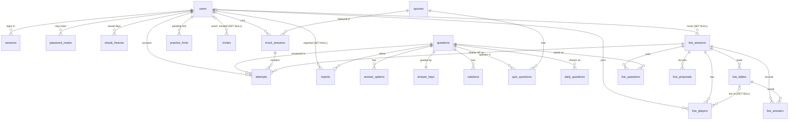

# Data model

Every table in the PostgreSQL database, what it holds, how it links to the others and which tables hold personal data. The source of truth is `src/ifs_tests/db/models.py`; the schema is built by the Alembic migrations in `migrations/versions/`. How the tables are used at run time (locks, jobs, answer secrecy) is in [architecture.md](architecture.md); the scoring the numbers feed is in [game-rules.md](game-rules.md).

Conventions:

- Times are `timestamp with time zone`, stored in UTC; "Madrid day" dates (`date` columns) are computed with `domain/daily.madrid_day`.
- Enumerations are strings with a `CHECK` constraint generated from a Python tuple in `models.py` (`ROLES`, `STATUSES`, `VERTICALS`, `POSITIONS`, `AREAS`, `KINDS`, `MODES`, `LIVE_STATES`). Widening one needs a migration.
- Constraint and index names follow the naming convention at the top of `models.py` (`pk_<table>`, `fk_<table>_<column>_<referred table>`, `ix_…`, `uq_…`, `ck_<table>_<name>`).
- **Watch the XP column names on `users`:** the ORM attribute `User.xp` maps to the column `account_xp`, and `User.legacy_xp` maps to the column `xp`. In raw SQL, `users.xp` is the old column (see [pending contract steps](#pending-contract-steps)).

## Entity relationships

The main tables. Bank join tables (`quiz_events`, `quiz_documents`), `settings` and `audit_log` are left out for readability.

## Accounts

### `users`

One row per member. **Personal data.**

| Column | Meaning |
|---|---|
| `id` | Identity primary key |
| `email` | Login identifier, lower-case (`CHECK email = lower(email)`), unique; shown to admins only. Only an admin can change it (audited as `user.email`, without the addresses) |
| `password_hash` | Argon2id hash (`auth/passwords.py`); never in any response |
| `display_name` | 2–24 characters, Latin letters, digits, `. ' -`; unique on `lower(display_name)` (index `uq_users_display_name_lower`); look-alikes are also refused in code by comparing skeletons (`domain/accounts.name_skeleton`) |
| `vertical` | One of `Management`, `Mechanical`, `Tractive System`, `Electronics`, `Driverless`, `Business`, `Board`, or null |
| `role` | `member`, `reviewer` or `admin` (what they may do in the app) |
| `status` | `active`, `alumni` or `disabled`; only active accounts can sign in or appear on boards |
| `position` | Job on the team: `mingo`, `member` (returning member), `department_head`, `technical_director`. Sets the rank placement; Technical Directors may host live quizzes |
| `leaderboard_opt_out` | Hidden from other people's boards |
| `failed_logins`, `locked_until` | Consecutive failed password checks; lock end after the fifth (15 minutes) |
| `last_seen`, `created_at` | Last request (touched at most every 5 minutes) and sign-up time |
| `account_xp` (attribute `xp`) | Account XP, integer, only goes up; sets the account level |
| `xp` (attribute `legacy_xp`) | Lifetime XP of the release before ADR 0007. Unused; kept for the previous release during a deploy, to drop |
| `rank_points` | Rank, `numeric(8,2)`: 100 points per division, 0 = Mingo I, 1500+ = the top title; floor 0 |
| `rank_season` | Season (start year) the rank belongs to; 0 = placed by the migration, no reset due |
| `rank_best` | Highest division reached this season (only a new one plays the promotion) |
| `combo`, `miss_streak` | Right answers in a row (XP combo) and wrong ones in a row (LP cushion); capped at 99 |
| `rested_xp`, `rested_on` | Banked rested XP and the Madrid day it was last topped up |
| `streak_freezes`, `freeze_earned_on` | Streak freezes held (0–2) and the streak day that last earned one |
| `subdepartments` | Team Directory department codes (`domain/live.SUBDEPARTMENTS`), `varchar(8)[]`; the first seats them in live quizzes |
| `left_at` | When they became alumni or disabled; the account is deleted 365 days later. Cleared when reactivated |

### `sessions`

Server-side sign-in sessions. **Personal data.**

| Column | Meaning |
|---|---|
| `id_hash` | SHA-256 of the cookie value (primary key); the cookie itself is never stored |
| `user_id` | → `users`, `ON DELETE CASCADE`, indexed |
| `created_at`, `last_seen` | Start and last activity; idle after 12 hours |
| `expires_at` | Absolute end, 30 days after sign-in; indexed for the nightly purge |

### `invites`

Single-use sign-up links (7 days). Deleted by the nightly job 30 days after being used or expiring. **Personal data** (the note may name someone).

| Column | Meaning |
|---|---|
| `token_hash` | SHA-256 of the token, unique |
| `role`, `vertical` | Given to the account created from it |
| `note` | Up to 80 characters for admins ("who it's for"); never copied to the audit log; cleared when the account it created is deleted |
| `created_by`, `used_by` | → `users`, `ON DELETE SET NULL` |
| `created_at`, `expires_at`, `used_at` | Lifecycle |

### `password_resets`

Single-use reset links issued by an admin (24 hours). Deleted 30 days after use or expiry.

| Column | Meaning |
|---|---|
| `token_hash` | SHA-256 of the token, unique |
| `user_id` | Whose password → `users`, `ON DELETE CASCADE`, indexed |
| `created_by` | The admin → `users`, `ON DELETE SET NULL` |
| `created_at`, `expires_at`, `used_at` | Lifecycle; a password change or reset marks every open link as used |

### `streak_freezes`

A Madrid day on which a streak freeze kept someone's daily streak alive. Primary key (`user_id`, `day`); `user_id` → `users`, `ON DELETE CASCADE`. **Personal data.**

## Question bank

Loaded from the FS-Quiz mirror by `ifs-tests push` (`services/bank.import_bank`). Events, quizzes and documents keep their FS-Quiz IDs; questions get our own IDs and keep FS-Quiz's in `fsquiz_id`, so the team could add its own questions later. None of these tables hold personal data.

### `events`

A competition (FSG, FSA…): `id` (FS-Quiz event ID), `short_name`, `name`, `country`.

### `quizzes`

A past registration quiz.

| Column | Meaning |
|---|---|
| `id` | FS-Quiz quiz ID |
| `year`, `held_on` | Season year and date held (may be null) |
| `vehicle_class` | As FS-Quiz gives it: `ev`, `cv`, `dv` |
| `status` | FS-Quiz status, e.g. `complete`, `missing_correct_answer`, `unpublished` |
| `information` | Free text from FS-Quiz |
| `last_qualifier` | JSON from FS-Quiz describing the last team that got a slot; drives the "bar to beat" (`domain/mock.bar_to_beat`) |

`quiz_events` links quizzes and events (both `ON DELETE CASCADE`).

### `documents` and `quiz_documents`

The rulebooks, handbooks and other documents a quiz was based on. Linked, never copied: `path` is relative to `doc.fs-quiz.eu` (or a full URL for a few). `type` (`Rulebook`, `Additional Rules`, `Handbook`…), `year`, `version`, `event_ids` (integer array; empty = applies to every event). `quiz_documents` links quizzes and documents, `ON DELETE CASCADE`, indexed on `document_id`.

### `questions`

| Column | Meaning |
|---|---|
| `id` | Our ID (identity) |
| `fsquiz_id` | FS-Quiz question ID, unique (null for questions of our own) |
| `type` | FS-Quiz type: `single-choice`, `multi-choice`, `input`, `input-range`, `drag_sort` |
| `text` | Question text |
| `time_s` | The real quiz's time budget in seconds, or null |
| `images` | Media file names (`<hash>.webp`) served from `/media/` |
| `area` | `mech`, `elec`, `rules` or `unclassified`; indexed |
| `topic` | A topic of that area (`bank/topics.AREAS`), or null |
| `difficulty` | 1–5, set on import and recalibrated nightly |
| `answer_kind` | How the answer is entered: `choice-one`, `choice-many`, `number`, `numbers`, `range`, `text`, or `self` (reveal only). Safe to show before answering |
| `graded` | Answers can be scored automatically; daily questions, mock quizzes and live quizzes use graded ones only |
| `playable` | Served to players: `NOT images_missing AND NOT excluded` |
| `images_missing` | An image referenced by the question isn't in the media directory yet |
| `excluded`, `exclusion_note` | Hidden, and why: by a reviewer, or by the import when FS-Quiz says it removed the question (the note then starts with "FS-Quiz") |
| `labels_reviewed` | A reviewer confirmed area and topic; re-imports keep them |
| `source_hash` | SHA-256 of the FS-Quiz content (type, text, time, answers, images, solutions); an unchanged hash skips the question on re-import |
| `key_changed_at` | Set when a re-import changed the official answer, dropped a correction or touched a hidden question: the reviewers' "changed" queue |
| `upstream_note` | FS-Quiz's sentence saying the question was removed from its quiz, as last seen on import (`domain/upstream.py`). A new note hides the question once; the same note on later imports doesn't hide it again |
| `created_at`, `updated_at` | |

### `answer_options`

The choices of a choice question: `question_id` (→ `questions`, `ON DELETE CASCADE`, indexed), `position`, `text`, `fsquiz_id` (FS-Quiz's answer ID; null only for rows loaded before migration 0017, until the next `push` fills it) and `retired`. Which options are correct is **not** here.

An option's `id` is stable: `attempts.answer`, `live_answers.answer` and choice keys point at it. A re-import updates options in place, matched by `fsquiz_id` (or by text for rows without one), and never deletes them: an option FS-Quiz removed becomes `retired`, which players are never offered again but which still shows in the answers that picked it.

### `answer_keys`

One row per question (`question_id` is the primary key, → `questions`, `ON DELETE CASCADE`). Kept apart so that nothing serialising a question can leak it.

| Column | Meaning |
|---|---|
| `key` | FS-Quiz's answer parsed by `domain/keys.py`: `{"kind": "choice", "mode": "one"\|"all", "options": [option ids]}`, `{"kind": "number"\|"numbers"\|"range"\|"text", "accept": [...]}` (any accepted alternative counts), `{"kind": "self"}` (shown, not graded; also a choice question with a single option), or null when there is no official answer. Re-parsed on every import, so a parser fix reaches questions FS-Quiz didn't change |
| `display` | The official answer as text, shown after answering |
| `override`, `override_display` | A reviewer's correction in the same format; used instead of `key` (`AnswerKey.effective`); dropped when FS-Quiz changes the question |

### `solutions`

Worked solutions: `question_id` (→ `questions`, `ON DELETE CASCADE`, indexed), `text`, `images`.

### `quiz_questions`

A quiz's questions in order: primary key (`quiz_id`, `question_id`), `position`; both `ON DELETE CASCADE`; indexed on `question_id`. A question FS-Quiz lists twice keeps its first position.

## Playing

### `attempts`

One answer to one question, in any mode. **Personal data.** The largest table.

| Column | Meaning |
|---|---|
| `id` | `bigint` identity |
| `user_id` | → `users`, `ON DELETE CASCADE` |
| `question_id` | → `questions`, `ON DELETE CASCADE`, indexed |
| `mode` | `practice`, `daily`, `mock` or `live` |
| `answer` | JSON `{"options": [option ids] or null, "value": text or null, "unsure": bool}`; `{}` while a timed question is running |
| `correct` | True, false, or null when the question isn't graded (the official answer was only shown) |
| `created_at` | When the question was shown (timed modes) or answered (practice) |
| `day` | Daily only: the Madrid day of the daily question |
| `area` | The area the answer was played under, so relabelling a question later doesn't move anyone's LP between boards |
| `deadline_at` | Timed modes: when the clock runs out (grace of 3 s on top) |
| `submitted_at` | When answered, or when closed as late; null while running |
| `late` | Answered or closed after the deadline plus grace: counts as wrong |
| `xp` | XP earned (integer). Rows from before migration 0014 may be negative (old penalties) |
| `lp` | LP won or lost, `numeric(7,2)` |
| `hint_used` | A hint was taken before answering |
| `passed` | "I'm not sure": no answer given, stored as not right |
| `session_id` | Mock run → `mock_sessions`, `ON DELETE CASCADE`, indexed |
| `live_session_id` | Live quiz → `live_sessions`, `ON DELETE CASCADE`, indexed |
| `points` | Season points of an early design (migration 0005). Unused since 0008; always written as 0 |

Indexes: `ix_attempts_user_question` (`user_id`, `question_id`), which also serves most per-user queries; **`ix_attempts_lp_day`** on (`user_id`, the Madrid day an answer's LP belongs to: `coalesce(day, date(timezone('Europe/Madrid', created_at)))`) `WHERE lp != 0 AND mode IN ('daily', 'practice')` (migration 0019), through which the leaderboards read each member's play in a period instead of all history (`models.LP_DAY` and `models.RANKED_PLAY` are the expression and predicate, written with literals for the same reason as below; a mock run's LP goes by the run's `started_at` instead, through `ix_mock_sessions_user_id` and `ix_attempts_session_id`); and the **partial unique index `uq_attempts_daily`** on (`user_id`, `day`, `area`) `WHERE mode = 'daily'`: one daily attempt per player, day and area. `services/daily.start` relies on it with `INSERT ... ON CONFLICT DO NOTHING`; the predicate must be written as the literal `text("mode = 'daily'")`, because a bound parameter stops Postgres matching the partial index once psycopg prepares the statement.

### `practice_hints`

A hint taken on a practice question, spent by the next answer to it. Primary key (`user_id`, `question_id`), both `ON DELETE CASCADE`; `created_at`. **Personal data.**

### `daily_questions`

The question of the day per area, fixed once chosen: primary key (`day`, `area`), `question_id` (→ `questions`, `ON DELETE CASCADE`, indexed). A chosen question a reviewer hides is replaced (upsert) for anyone who hasn't started it.

### `mock_sessions`

One run through a past quiz. **Personal data.**

| Column | Meaning |
|---|---|
| `user_id` | → `users`, `ON DELETE CASCADE`, indexed |
| `quiz_id` | → `quizzes`, `ON DELETE CASCADE` |
| `season` | Season (start year) the run started in |
| `counted` | The first run of this quiz this season: moves LP. Replays earn XP only |
| `position` | Questions answered so far |
| `started_at`, `finished_at` | Null `finished_at` = still open |

Partial unique index **`uq_mock_sessions_open`** on (`user_id`, `quiz_id`) `WHERE finished_at IS NULL`: one open run per player and quiz; `services/mock.start` inserts with `ON CONFLICT DO NOTHING` and returns the open run.

### `reports`

A player's note that something is wrong with a question they have answered.

| Column | Meaning |
|---|---|
| `question_id` | → `questions`, `ON DELETE CASCADE`, indexed |
| `user_id` | Reporter → `users`, `ON DELETE SET NULL`: the report stays for reviewers without the name |
| `message` | Up to 500 characters of free text. **Personal data** while `user_id` is set |
| `created_at`, `resolved_at`, `resolved_by` | `resolved_by` → `users`, `ON DELETE SET NULL` |

Partial unique index **`uq_reports_open`** on (`question_id`, `user_id`) `WHERE resolved_at IS NULL`: one open report per player and question; a new one replaces the text.

## Live quiz

All `ON DELETE CASCADE` from `live_sessions`; sessions themselves are never deleted by the app.

### `live_sessions`

| Column | Meaning |
|---|---|
| `code` | Six characters without look-alikes, unique |
| `host_id` | → `users`, `ON DELETE SET NULL` (migration 0013): a deleted host's sessions are finished and keep their results; indexed |
| `config` | JSON of `LiveConfig` (`api/schemas.py`): `questions` (`areas`/`quiz`), `areas`, `topics`, `quiz_id`, `count`, `timing` (`real`/`fixed`/`host`), `seconds`, `feedback` (`each`/`end`), `speed_points`, `routing` (`all`/`owners`) |
| `state` | `lobby`, `open`, `closed`, `finished`. The nightly job finishes a session still unfinished a day after `created_at` |
| `position` | Current question, −1 in the lobby |
| `opened_at`, `deadline_at` | When the current question opened and its deadline (null when host-paced) |
| `version` | Goes up on every change but a proposal; the event stream sends it |
| `created_at`, `finished_at` | |

### `live_tables`

`session_id` (indexed), `name` (40 characters), `captain_id` (→ `users`, `ON DELETE SET NULL`), `topics` (topics the table owns, for routing), `catch_all` (takes the questions nobody owns), `proposals` (goes up on every proposal to the table, so the event stream wakes only that table's screens; migration 0018).

### `live_players`

Who joined. Primary key (`session_id`, `user_id`); `user_id` → `users`, `ON DELETE CASCADE`; `table_id` → `live_tables`, `ON DELETE SET NULL`; `joined_at`; `removed` (removed by the host, kept so joining again is refused). **Personal data.**

### `live_questions`

The session's questions in order. Primary key (`session_id`, `position`); `question_id` → `questions`; `table_id` → `live_tables`, `ON DELETE SET NULL` (null = every table answers); `budget_s` (seconds, null when host-paced).

### `live_answers`

A table's one answer to a question. Primary key (`session_id`, `position`, `table_id`), so a second answer from the same table is refused. **Personal data.**

| Column | Meaning |
|---|---|
| `answer` | JSON like `attempts.answer` |
| `correct`, `passed` | As in `attempts` |
| `points` | Speed points (0 unless the host turned them on) |
| `by_user_id` | The captain who sent it → `users`, `ON DELETE SET NULL` |
| `submitted_at` | |
| `member_ids` | Integer array of who sat at the table when it answered: they share the XP. Not a foreign key: account deletion removes the ID with `array_remove` |
| `granted` | XP has been shared to the members |

### `live_proposals`

What a player suggests to the captain. Primary key (`session_id`, `position`, `user_id`); `user_id` → `users`, `ON DELETE CASCADE`; `table_id` → `live_tables`, `ON DELETE CASCADE`; `answer`; `updated_at`. **Personal data.**

## System

### `settings`

Key–value store (`key` varchar(64) primary key, `value` JSONB). Today it has exactly one key:

| Key | Value | Used for |
|---|---|---|
| `hint_salt` | `{"salt": "<64 hex characters>"}`: 32 random bytes | A server secret: the HMAC seed for hints (`services/hints._seed`), the daily question draw (`domain/daily.pick`) and the XP critical roll (`services/xp._crit`). Created on first use with `INSERT ... ON CONFLICT DO NOTHING` (`services/hints.salt`), so a fresh database gets its own |

Treat `hint_salt` as a secret: with it and the question bank, anyone could predict daily questions and run hints backwards. It is in every database backup. Deleting the row makes the app create a new one; hints then change, so a player who already took a hint could get a second, different one.

### `audit_log`

Insert-only record of privileged actions: `id` (bigint), `at`, `actor_id` (the acting user's ID, or null for the system; **no foreign key**, so accounts can be deleted while the log keeps the number), `action`, `target` (such as `user:12`, `question:345`, `invite:7`, `fsquiz`), `details` (JSONB: what changed). **Personal data** (IDs of the actor and target, and before/after values).

Actions written: `user.register`, `user.bootstrap_admin`, `user.locked`, `user.update`, `user.email`, `user.revoke_sessions`, `user.export`, `user.delete`, `invite.create`, `invite.revoke`, `reset.create`, `password.change`, `password.reset`, `question.update`, `question.answer`, `question.answer_cleared`, `report.resolve`, `bank.import`. Invite notes are never recorded (migration 0013 removed old ones).

The migration 0002 revokes `UPDATE`, `DELETE` and `TRUNCATE` on `audit_log` from the production app role `app_rt` (`deploy/db/roles.sql`), so the running app can't rewrite history. The nightly purge (`services/privacy.purge`) calls the function **`purge_audit_log(before)`** instead (migration 0016): owned by `migrator`, `SECURITY DEFINER`, executable only by `app_rt`, it deletes entries older than `before` but never any younger than 730 days by the database's own clock, and returns how many it deleted. So the app can apply the two-year keep (`AUDIT_KEEP` in `domain/accounts.py`) but can't wipe the log through it.

### `alembic_version`

Alembic's current revision: the newest file in `migrations/versions/` (the table under [Migrations](#migrations) lists them).

## Personal data

[ADR 0006](adr/0006-personal-data.md) sets the rules; `services/privacy.py` implements them. AGENTS.md requires anything new stored about a person to appear in `services/privacy.export` and to go when the account is deleted (a cascading foreign key or a step in `privacy._delete`).

| Table | Export (`GET /api/me/export`) | On account deletion |
|---|---|---|
| `users` | `account`: email, name, vertical, sub-departments, position, role, status, XP (and `xp_before_ranked`, the old `users.xp`), rank points, rank season, best division this season, right and wrong answers in a row, rested XP and when it was topped up, streak freezes held and when one was last earned, opt-out, joined, last seen, failed sign-ins, lock, inactive since, deletion date. Only `id` and `password_hash` are left out | Row deleted |
| `sessions` | `sign_ins` | Cascade |
| `invites` | `invite`: the one they signed up with (role, vertical, note, used) | Note cleared, `used_by`/`created_by` set null |
| `password_resets` | `password_resets`: created, expires, used (never the token hash) | Cascade (`user_id`); `created_by` set null |
| `streak_freezes` | `streak_freezes_used` (the days) | Cascade |
| `attempts` | `answers` (right/wrong, XP and LP hidden while a mock run or live quiz is unfinished) | Cascade |
| `practice_hints` | `pending_hints` | Cascade |
| `mock_sessions` | `mock_runs` | Cascade (and their attempts) |
| `reports` | `reports` | `user_id` set null; the message stays |
| `live_players` | `live.joined` (table, captain, removed) | Cascade |
| `live_sessions` (hosted) | `live.hosted` | Unfinished ones are finished; `host_id` set null; XP shared |
| `live_tables.captain_id` | `live.joined[].captain` | Set null |
| `live_answers` | `live.answers_sent_as_captain` | `by_user_id` set null; ID removed from `member_ids` |
| `live_proposals` | `live.proposals` | Cascade |
| `audit_log` | `account_history` (entries about them), `actions` (what they did, with other people shown only as "user") | Kept with the numeric IDs; purged after two years |

Retention: alumni and disabled accounts are deleted 365 days after `left_at`; the audit log keeps two years; closed invite and reset links 30 days; backups 14 days. All of these run in the nightly job (see [architecture.md](architecture.md#background-work)).

`test_every_personal_column_is_exported_or_deliberately_left_out` in `tests/api/test_privacy.py` keeps this table honest: it lists every `users` column and every column pointing at a user, with where each lands in the export or why it is left out (an admin's work on someone else's account, such as `invites.created_by`, is in the admin's own `actions` instead), and fails when a new one appears in neither list.

## Migrations

`migrations/versions/`, run with `alembic upgrade head` (as the `migrator` role in production, by `deploy/deploy.sh`). How to write one is in [development.md](development.md).

| Revision | What it did |
|---|---|
| 0001 | `settings` and `audit_log` |
| 0002 | `users`, `invites`, `password_resets`, `sessions`; `uq_users_display_name_lower`; revokes `UPDATE`/`DELETE`/`TRUNCATE` on `audit_log` from `app_rt` when that role exists |
| 0003 | The question bank: `events`, `quizzes`, `quiz_events`, `questions`, `answer_options`, `answer_keys`, `solutions`, `quiz_questions` |
| 0004 | `attempts` (practice answers) with `ix_attempts_user_question` |
| 0005 | `daily_questions`; timed-attempt columns on `attempts` (`day`, `area`, `deadline_at`, `submitted_at`, `late`, `points`) and `uq_attempts_daily` |
| 0006 | `mock_sessions` with `uq_mock_sessions_open`; `attempts.session_id` |
| 0007 | Review tools: `reports` with `uq_reports_open`; `answer_keys.override`/`override_display`; `questions.images_missing`, `excluded`, `exclusion_note`, `labels_reviewed` |
| 0008 | XP and levels (ADR 0004): `attempts.xp`, `hint_used`; `questions.difficulty` with starting values; `users.position` and `users.xp` |
| 0009 | `attempts.passed` ("I'm not sure") |
| 0010 | `documents` and `quiz_documents` |
| 0011 | `practice_hints` |
| 0012 | Live quiz tables (`live_sessions`, `live_tables`, `live_players`, `live_questions`, `live_answers`, `live_proposals`); `attempts.live_session_id`; `users.subdepartments`; `live` added to the attempt modes |
| 0013 | Privacy: `users.left_at` (set for accounts already inactive); `live_sessions.host_id` nullable with `ON DELETE SET NULL`; invite notes removed from the audit log |
| 0014 | Ranked LP (ADR 0007): `attempts.lp`; `users.rank_points`, `rank_season`, `rank_best`, `combo`, `miss_streak`, `account_xp`. Places everyone by position, raises single-choice difficulty by one, fills `account_xp` from positive attempt XP. Expand only: `users.xp` stays |
| 0015 | Rested XP and streak freezes: `streak_freezes` table; `users.rested_xp`, `rested_on`, `streak_freezes`, `freeze_earned_on` |
| 0016 | The function `purge_audit_log(before)` for the nightly audit purge, executable by `app_rt` ([`audit_log`](#audit_log)) |
| 0017 | Stable options: `answer_options.fsquiz_id` and `retired`; `questions.upstream_note`. Expand only: the previous release ignores the new columns, and the next `ifs-tests push` fills `fsquiz_id` |
| 0018 | `live_tables.proposals`, a counter per table so a proposal wakes only that table's screens. Expand only |

### Expand/contract

`deploy.sh` migrates the database first and only then restarts the app, and rolls back to the previous image if the new one fails its smoke test. So the **previous release must keep working against the new schema**:

- **Expand** in one release: add tables and nullable (or defaulted) columns, widen checks, backfill. Never rename or drop something the running release uses.
- **Contract** in a later release, once no deployed image uses the old column: drop it.

Example: 0014 added `account_xp` and left `xp` in place, because the release before ADR 0007 still wrote lifetime XP there during the deploy; the model maps the old column as `legacy_xp` so SQLAlchemy keeps it in the schema. `tests/integration/test_migrations.py` checks upgrade → downgrade → upgrade and that the models and migrations produce the same schema.

The other direction isn't promised: a newer release may not run on an older schema. So `deploy/restore.sh` migrates an older dump up to the deployed release before it starts the app, and refuses a dump from a newer release than the deployed one. Grants a migration makes beyond the defaults in `deploy/db/roles.sql` (0002 on `audit_log`, 0016 on `purge_audit_log`) are part of every dump, so a restore brings them back.

### Pending contract steps

- Drop `users.xp` (attribute `legacy_xp`) and remove it from the model: planned in `feat/20-launch` (`.github/roadmap.yaml`).
- `attempts.points` has been unused since 0008 (always 0 in new rows). Not scheduled; drop it in the same kind of contract release if nobody needs old values.
